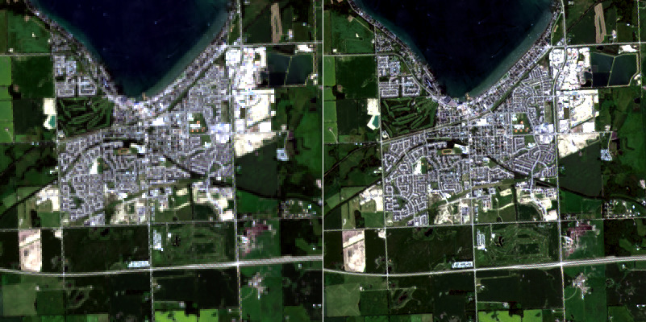

```@meta
CurrentModule = RemoteSensingToolbox
```

# Pansharpening

Pansharpening is the process of merging a high-resolution panchromatic image with a lower resolution 
multispectral image to produce a high-resolution color image. Typically, the panchromatic band covers 
the wavelengths of several bands in the corresponding multispectral image. For example, the panchromatic 
band in Landsat 8 corresponds to the same wavelengths as the RGB bands. Here we will demonstrate a fairly
simple method, which involves replacing the value channel from an HSV representation of the color image 
with the panchromatic band. As always, the first step is to read the necessary layers from disk.

```julia
using RemoteSensingToolbox, Rasters, Images

# Read RGB and Panchromatic Bands
src = Landsat8("data/LC08_L1TP_043024_20200802_20200914_02_T1")
stack = RasterStack(src, [:red, :green, :blue], lazy=true)
panchromatic = Raster(src, :panchromatic, lazy=true)
```

Next, we crop our data to a region of interest, resample our RGB bands to the same resolution as the
panchromatic band, and visualize the results.

```julia
# Crop to Region of Interest
roi = @view stack[X(6715:6914), Y(1500:1699)]
roi_hr = Rasters.resample(roi, res=15)  # Resample RGB to 15m
roi_pan = Rasters.crop(panchromatic, to=roi_hr)

# Visualize RGB and Panchromatic Bands
rgb = visualize(roi_hr...)
pan = visualize(roi_pan)
img = mosaicview(rgb, pan, npad=1, ncol=2, rowmajor=false, fillvalue=RGB(1.0,1.0,1.0))
```


As we can see, the panchromatic band provides double the spatial resolution of the RGB bands 
(15m vs 30m), but contains only a single channel of color. Our goal is to combine them to 
acquire a high-resolution RGB image. This can be done quite simply by first converting our RGB image 
to the HSV color-space then replacing the value channel with the histogram-matched panchromatic band.

```julia
# Convert to HSV and Replace Value Band with Panchromatic
hsv = HSV.(rgb)
adjust_histogram!(pan, Matching(targetimg=channelview(hsv)[3,:,:]))
channelview(hsv)[3,:,:] .= gray.(pan)
sharpened = RGB.(hsv)

# Visualize
img = mosaicview(rgb, sharpened, npad=1, ncol=2, rowmajor=false, fillvalue=RGB(1.0,1.0,1.0))
```



The side-by-side results show that replacing the value channel has indeed sharpened the image
considerably. Moreover, the color of the original image has been largely preserved by the 
transformation. A common alternative to the HSV method is to first perform a PCA transformation 
along the spectral dimension, replace the first principal component with the panchromatic band, 
then reverse the transformation to recover the sharpened image.