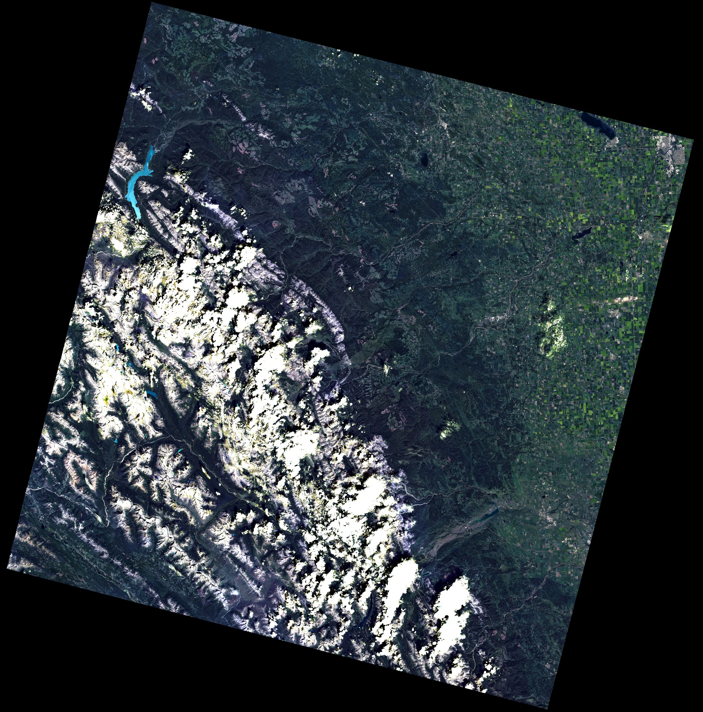
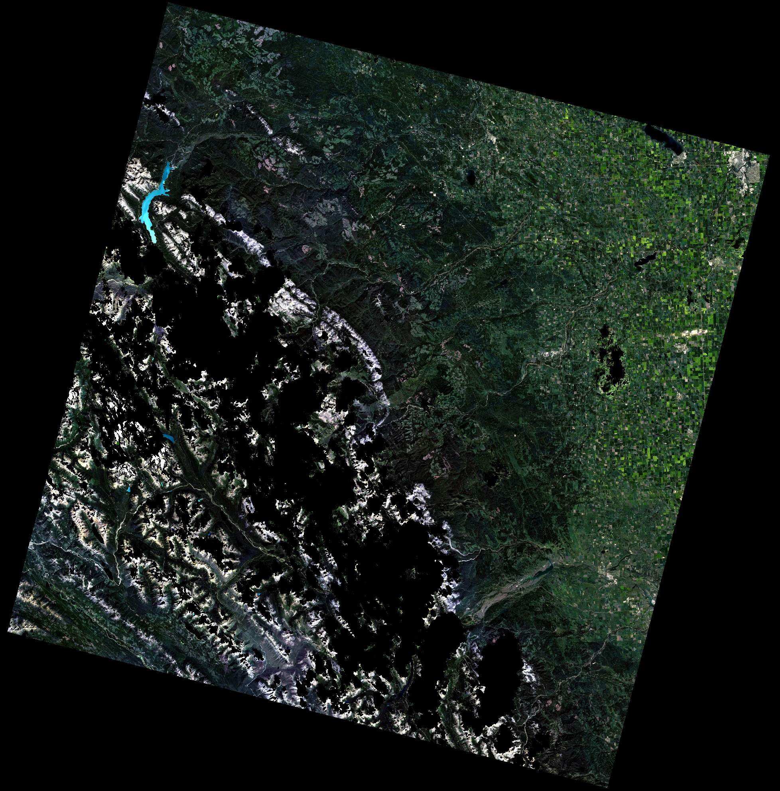

```@meta
CurrentModule = RemoteSensingToolbox
```

# Quick Start

`RemoteSensingToolbox` provides a number of utilities for visualizing, manipulating, and interpreting remotely sensed imagery. First, lets load the imagery we want to work with. We're using Landsat 8 imagery in this example, so we'll pass the `Landsat8` type to `read_bands` so it knows how to parse the relevant files from the provided directory. `Landsat8` is an instance of `AbstractBandset`, which is the supertype responsible for allowing many methods within `RemoteSensingToolbox` to infer sensor-specific information by exploiting Julia's multiple dispatch system.

```julia
using RemoteSensingToolbox, Rasters

src = Landsat8("LC08_L2SP_043024_20200802_20200914_02_T1")
stack = RasterStack(src, lazy=true)
```

Now let's visualize our data to see what we're working with. This is where the power of `AbstractBandset` can first be demonstrated. To view a true color composite of the data, we need to know the bands corresponding to red, green, and blue. However, it would be tedious to memorize and manually specify this information whenever we want to call a method which relies on a specific combination of bands. Fortunately, all `AbstractBandset` types know this information implicitly, so all we need to do is pass in `Landsat8` as a parameter to `TrueColor`.

```julia
visualize(TrueColor{Landsat8}, stack; upper=0.90)
```



You may have noticed that we provided an additional argument `upper` to the `visualize` method. This parameter controls the upper quantile to be used when performing histogram stretching to make the imagery interpretable to humans. This parameter is set to 0.98 by default, but because our scene contains a significant number of bright clouds, we need to lower it to prevent the image from appearing too dark. We can remove these clouds by first loading the Quality Assurance (QA) mask that came with our landsat product and then calling `mask_pixels`.

```julia
# Mask Clouds
cloud_mask = Raster(src, :clouds)
shadow_mask = Raster(src, :cloud_shadow)
raster_mask = .!(boolmask(cloud_mask) .|| boolmask(shadow_mask))
masked = mask(stack, with=raster_mask)

# Visualize in True Color
visualize(TrueColor{Landsat8}, masked)
```



Now let's try to visualize some other band combinations. The `Agriculture` band comination is commonly used to distinguish regions with healthy vegetation, which appear as various shades of green.

```julia
visualize(Agriculture{Landsat8}, stack; upper=0.90)
```


We'll finish this example by demonstrating how to compute land cover indices with any `AbstractBandset` type. The Modified Normalized Difference Water Index (MNDWI) is used to help distinguish water from land. Here, we visualize both the true color representation and the corresponding MNDWI index.

```julia
# Calculate Indices
indices = (mndwi=mndwi(src), ndvi=ndvi(src), ndmi=ndmi(src))

# Extract Region of Interest
stack = merge(stack, indices)
roi = @view stack[X(5800:6800), Y(2200:3200)]

# Visualize
true_color = visualize(TrueColor{Landsat8}, roi; upper=0.998)
index_imgs = [visualize(roi[i]) for i in (:mndwi, :ndvi, :ndmi)]
mosaicview(true_color, index_imgs...; npad=10, fillvalue=0.0, ncol=2, rowmajor=true)
```

