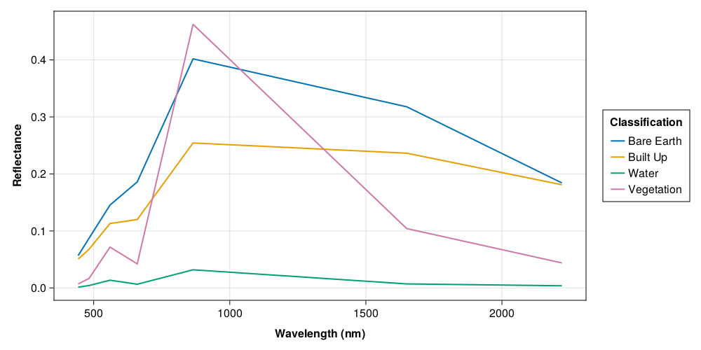
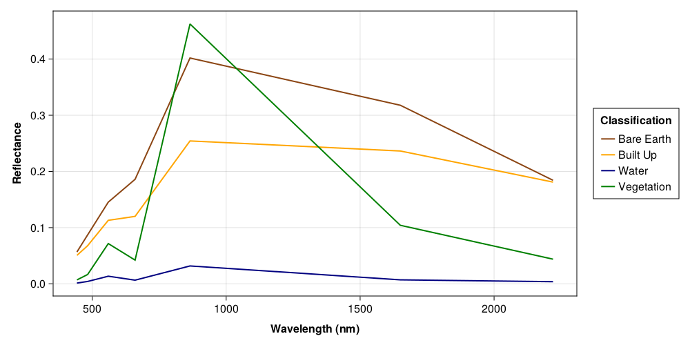
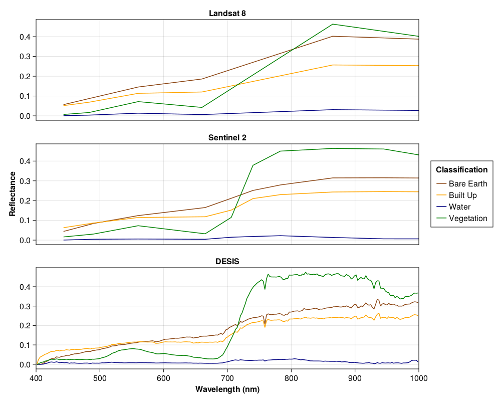

```@meta
CurrentModule = RemoteSensingToolbox
```

# Spectral Analysis

Land cover classification is a common application of remotely sensed imagery. Such a task involves 
assigning a discrete label to each pixel in an image denoting the type of land contained within
it. For example, we may wish to classify each pixel as either water or land. This is typically 
accomplished by observing the unique spectral signatures produced by each material. `RemoteSensingToolbox`
provides a number of methods for both extracting and visualizing signatures from a labelled image.

Our first step is to read the relevant bands from disk and convert the DNs (Digital Numbers) to 
reflectance. Reflectance is a standardized unit of measurement defined over the interval [0, 1], which
denotes the fraction of light reflected by the observed surface. A reflectance of 0.0 indicates that
no light was reflected at all, whereas a reflectance of 1.0 tells us that 100% was reflected. 
Fortunately, each `AbstractSatellite` contains the necessary information for this conversion.

```julia
using RemoteSensingToolbox, Rasters, ArchGDAL, Statistics, DataFrames, Shapefile

# Read Landsat, Sentinel, and DESIS Bands
landsat_src = Landsat8("data/LC08_L2SP_043024_20200802_20200914_02_T1")
sentinel_src = Sentinel2{60}("data/S2B_MSIL2A_20200804T183919_N0214_R070_T11UPT_20200804T230343")
desis_src = DESIS("data/DESIS-HSI-L2A-DT0485529167_001-20220712T223540-V0220")
landsat = RasterStack(landsat_src, lazy=true)
sentinel = RasterStack(sentinel_src, lazy=true)
desis = Raster(desis_src, :Bands, lazy=true)

# Convert DNs to Surface Reflectance
landsat_sr = decode(Landsat8, landsat)
sentinel_sr = decode(Sentinel2{60}, sentinel)
desis_sr = decode(DESIS, desis)
```

Once we have our imagery, we need to acquire some labelled regions from which to extract the spectral signatures. 
This is typically accomplished with a shapefile consisting of polygons labelled with each type of land cover.

```julia
shp = Shapefile.Table("data/landcover/landcover.shp") |> DataFrame
```

Examining the shapefile gives us some insight into how its contents are structured. As we can see, the regions of
interest are stored as `Polygon` objects under the `:geometry` column, while land cover labels are under both
`:MC_name` and `:C_name`. In this case, `:MC_name` defines the macro class while `:C_name` defines the specific class.
For example, both "Trees" and "Vegetation" belong to the "Vegetation" macro class.

```
8×7 DataFrame
 Row │ geometry            fid      MC_ID  MC_name     C_ID   C_name      SCP_UID                   
     │ Polygon             Missing  Int64  String      Int64  String      String                    
─────┼──────────────────────────────────────────────────────────────────────────────────────────────
   1 │ Polygon(38 Points)  missing      1  Built Up        1  Built Up    20230527_122212594060_314
   2 │ Polygon(31 Points)  missing      1  Built Up        2  Road        20230527_122301732906_304
   3 │ Polygon(57 Points)  missing      2  Vegetation      4  Trees       20230527_123221462871_572
   4 │ Polygon(5 Points)   missing      3  Bare Earth      5  Hail Scar   20230527_123631491671_937
   5 │ Polygon(7 Points)   missing      3  Bare Earth      6  Bare Earth  20230527_123727873290_779
   6 │ Polygon(7 Points)   missing      4  Water           7  Lake        20230527_123931189139_867
   7 │ Polygon(5 Points)   missing      3  Bare Earth      6  Bare Earth  20230527_125120033074_286
   8 │ Polygon(5 Points)   missing      2  Vegetation      3  Vegetation  20230527_122832068862_308
```

We can call `extract_signatures` to retrieve the spectral signatures located within each polygon along with
their associated labels. An optional aggregation method can be supplied as the first argument, which will be
used to summarize signatures belonging to the same label. Some common examples are `mean`, `median`, `maximum`, 
and `minimum`. If no method is provided, `extract_signatures` will return all signatures and their labels.

```julia
sigs = extract_signatures(mean, landsat_sr, shp, :MC_name) |> DataFrame
```

```
4×8 DataFrame
 Row │ label       B1          B2          B3         B4          B5        B6          B7         
     │ String      Float32     Float32     Float32    Float32     Float32   Float32     Float32    
─────┼─────────────────────────────────────────────────────────────────────────────────────────────
   1 │ Bare Earth  0.0566671   0.0871629   0.145427   0.185996    0.401831  0.317775    0.184228
   2 │ Built Up    0.0506521   0.0679052   0.113027   0.120046    0.254274  0.236384    0.18103
   3 │ Water       0.00137886  0.00423271  0.0135606  0.00652965  0.031825  0.00709321  0.00381732
   4 │ Vegetation  0.00699952  0.0166328   0.0716218  0.0422207   0.462393  0.10416     0.0438761
```

While `extract_signatures` can be a good first step for further analysis or training classification models, we are 
also often interested in visualizing the signatures associated with each land cover type. To do so, we can import
`CairoMakie`, which is extended by `RemoteSensingToolbox` to provide signature plotting. In order to display the
appropriate wavelength for each band, `plot_signatures` expects either a vector of band-wavelength pairs or an
`AbstractSatellite` type as the first argument.

```julia
import CairoMakie

plot_signatures(Landsat8, landsat_sigs)
```



To override the default color scheme, we can provide an optional `colors` argument. Refer to 
[Colors.jl](https://juliagraphics.github.io/Colors.jl/stable/namedcolors/) for a complete list of all named colors.

```julia
colors = [:saddlebrown, :orange, :navy, :green]
fig = plot_signatures(Landsat8, landsat_sigs, colors=colors)
```



Sometimes we want to have more control over our plots than what is provided by `plot_signatures`. To accommodate
this need, we provide the `plot_signatures!` method, which directly modifies a provided `Makie.Axis` object. In
the following example, we will plot the same signatures produced by three different sensors, each of which passed
over our study area within a period of four days.

```julia
# Create Figure
fig = CairoMakie.Figure(resolution=(1000, 800))

# Create Axes
ax1 = CairoMakie.Axis(fig[1,1], title="Landsat 8", xticksvisible=false, xticklabelsvisible=false)
ax2 = CairoMakie.Axis(fig[2,1], title="Sentinel 2", ylabel="Reflectance", ylabelfont=:bold, xticksvisible=false, xticklabelsvisible=false)
ax3 = CairoMakie.Axis(fig[3,1], title="DESIS", xlabel="Wavelength (nm)", xlabelfont=:bold)

# Plot Signatures
axs = (ax1, ax2, ax3)
sensors = (Landsat8, Sentinel2{60}, DESIS)
rasters = (landsat_sr, sentinel_sr, desis_sr)
for (sensor, raster, ax) in zip(sensors, rasters, axs)
    sigs = extract_signatures(mean, raster, shp, :MC_name)
    plot_signatures!(ax, sensor, sigs; colors=colors)
    CairoMakie.xlims!(ax, 400, 1000)
end

# Add Legend
CairoMakie.Legend(fig[1:3,2], first(axs), "Classification")
```

